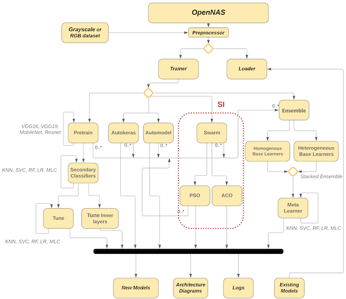
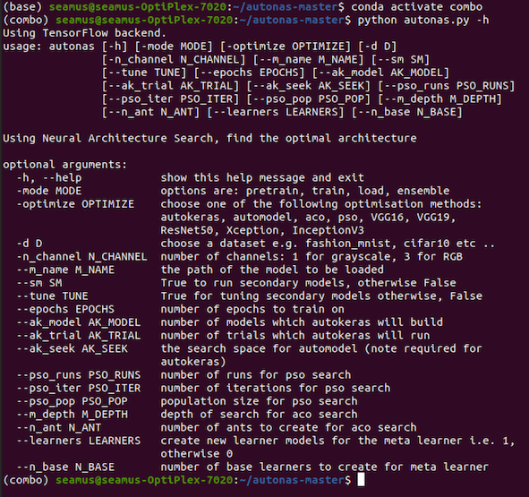

# OpenNAS

A system integrating open source tools for Neural Architecture Search (OpenNAS), in the classification of images, 
has been developed. OpenNAS takes any dataset of grayscale, or RBG images, and generates Convolutional Neural Network 
(CNN) architectures based on a range of metaheuristics using either an AutoKeras, a transfer learning or a Swarm Intelligence (SI) approach.

## Table of contents
* [General info](#general-info)
* [System Overview](#system-overview)
* [Technologies](#technologies) 
* [Setup](#setup)
* [Command Line Interface](#command-line-interface)
* [Inspiration](#inspiration)
* [Contact](#contact)

## General info
Despite a renewal of interest in AutoML, many of these open source solutions focus on creating simpler neural architectures. Libraries which concentrate on generating more complex architectures, such as CNNs, are at early stages of development. Consequently they are poorly documented and often unreliable. In addition, the alternative of using commercial platforms is expensive and therefore users are left with few practical or viable options.

The development of OpenNAS integrates several metaheuristic approaches in a single application used for the neural architecture search of more complex neural architectures such as convolutional neural networks. Furthermore, the effectiveness of NAS in generating good neural architectures for image classification is evaluated. Standard approaches to NAS, using the AutoKeras framework, are also incorporated into the system design.

A key aspect of the study is to contrast Swarm Intelligence (SI) algorithms for NAS. Consequently, Particle Swarm Optimization (PSO) and Ant Colony Optimization (ACO) have been chosen as metaheuristics for creating high performing CNN architectures for grayscale and RGB image datasets. Furthermore, models developed through such metaheuristics may be combined using stacking ensembles.

## System Overview

## Technologies
* Python 3.7
* Tensorflow 1.14 (or tensorflow-gpu ==2.1.1)
* Keras 2.2.4
* Numpy 1.16.4
* Matplotplib 3.1.0.

## Setup
Using conda virtual environments, create an environment and install appropriate packages.
With the exmaple below, the conda environment is called combo.

`conda create -n combo python=3.7`

`conda activate combo`

`conda install tensorflow-gpu==2.1.1`

`conda install keras =2.2.4`

`conda install numpy =1.16.4`

`conda install matplotlib =3.1.0`

`conda install colorama ==0.4.1`

`conda install pyyaml ==5.1`

`conda install scikit - learn ==0.20.3`

`pip install opencv - python`

`pip install deepswarm`

`pip install autokeras`

`pip install pydot`

`sudo apt - get install graphviz`

`pip install ruamel . yaml`

## Command Line Interface

## Inspiration
Dr Diarmuid Grimes, Cork Institute of Technology 

Junior, F.E.F. and Yen, G.G., 2019. Particle swarm optimization of deep neural networks architectures for image classification. 
Swarm and Evolutionary Computation, 49, pp.62-74.

Byla, E. and Pang, W., 2019, September. Deepswarm: Optimising convolutional neural networks using swarm intelligence. In UK 
Workshop on Computational Intelligence (pp. 119-130). Springer, Cham.

DeepSwarm library: 
Copyright (c) 2019 Edvinas Byla

pso-CNN:[particle.py, population.py, pso-CNN.py, utils.py] 
Copyright (c) 2020 Francisco Erivaldo Fernandes Junior

## Contact
Created by @seamuslankford - catch me on twitter!
